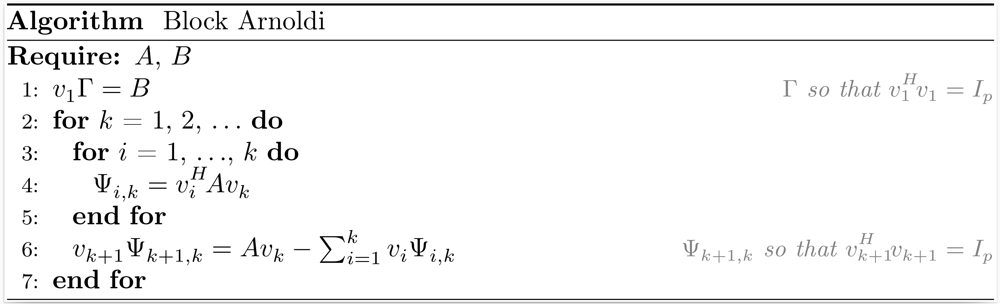
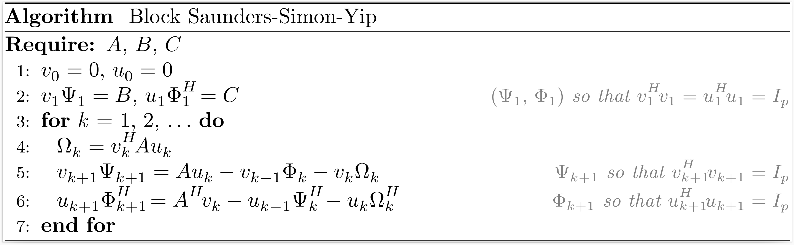

# [Block Krylov processes](@id block-krylov-processes)

## [Block Hermitian Lanczos](@id block-hermitian-lanczos)

If the vector $b$ in the [Hermitian Lanczos](@ref hermitian-lanczos) process is replaced by a matrix $B$ with $p$ columns, we can derive the block Hermitian Lanczos process.


After $k$ iterations of the block Hermitian Lanczos process, the situation may be summarized as
```math
\begin{align*}
  A V_k &= V_{k+1} T_{k+1,k}, \\
  V_k^H V_k &= I_{pk},
\end{align*}
```
where $V_k$ is an orthonormal basis of the block Krylov subspace $\mathcal{K}_k^{\square}(A,B)$,
```math
T_{k+1,k} =
\begin{bmatrix}
  \Omega_1 & \Psi_2^H &        &          \\
  \Psi_2   & \Omega_2 & \ddots &          \\
           & \ddots   & \ddots & \Psi_k^H \\
           &          & \Psi_k & \Omega_k \\
           &          &        & \Psi_{k+1}
\end{bmatrix}.
```

The function [`hermitian_lanczos`](@ref hermitian_lanczos(::Any, ::AbstractMatrix{FC}, ::Int) where FC <: (Union{Complex{T}, T} where T <: AbstractFloat)) returns $V_{k+1}$, $\Psi_1$ and $T_{k+1,k}$.

```@docs
hermitian_lanczos(::Any, ::AbstractMatrix{FC}, ::Int) where FC <: (Union{Complex{T}, T} where T <: AbstractFloat)
```

## [Block Non-Hermitian Lanczos](@id block-nonhermitian-lanczos)

If the vectors $b$ and $c$ in the [non-Hermitian Lanczos](@ref nonhermitian-lanczos) process are replaced by matrices $B$ and $C$ with both $p$ columns, we can derive the block non-Hermitian Lanczos process.


After $k$ iterations of the block non-Hermitian Lanczos process, the situation may be summarized as
```math
\begin{align*}
  A V_k &= V_{k+1} T_{k+1,k}, \\
  A^H U_k &= U_{k+1} T_{k,k+1}^H, \\
  V_k^H U_k &= U_k^H V_k = I_{pk},
\end{align*}
```
where $V_k$ and $U_k$ are bases of the block Krylov subspaces $\mathcal{K}^{\square}_k(A,B)$ and $\mathcal{K}^{\square}_k (A^H,C)$, respectively,
```math
T_{k+1,k} =
\begin{bmatrix}
  \Omega_1 & \Phi_2   &        &          \\
  \Psi_2   & \Omega_2 & \ddots &          \\
           & \ddots   & \ddots & \Phi_k   \\
           &          & \Psi_k & \Omega_k \\
           &          &        & \Psi_{k+1}
\end{bmatrix}
, \qquad
T_{k,k+1}^H =
\begin{bmatrix}
  \Omega_1^H & \Psi_2^H   &          &            \\
  \Phi_2^H   & \Omega_2^H & \ddots   &            \\
             & \ddots     & \ddots   & \Psi_k^H   \\
             &            & \Phi_k^H & \Omega_k^H \\
             &            &          & \Phi_{k+1}^H
\end{bmatrix}.
```

The function [`nonhermitian_lanczos`](@ref nonhermitian_lanczos(::Any, ::AbstractMatrix{FC}, ::AbstractMatrix{FC}, ::Int) where FC <: (Union{Complex{T}, T} where T <: AbstractFloat)) returns $V_{k+1}$, $\Psi_1$, $T_{k+1,k}$, $U_{k+1}$ $\Phi_1^H$ and $T_{k,k+1}^H$.

```@docs
nonhermitian_lanczos(::Any, ::AbstractMatrix{FC}, ::AbstractMatrix{FC}, ::Int) where FC <: (Union{Complex{T}, T} where T <: AbstractFloat)
```

## [Block Arnoldi](@id block-arnoldi)

If the vector $b$ in the [Arnoldi](@ref arnoldi) process is replaced by a matrix $B$ with $p$ columns, we can derive the block Arnoldi process.



After $k$ iterations of the block Arnoldi process, the situation may be summarized as
```math
\begin{align*}
  A V_k &= V_{k+1} H_{k+1,k}, \\
  V_k^H V_k &= I_{pk},
\end{align*}
```
where $V_k$ is an orthonormal basis of the block Krylov subspace $\mathcal{K}_k^{\square}(A,B)$,
```math
H_{k+1,k} =
\begin{bmatrix}
  \Psi_{1,1}~ & \Psi_{1,2}~ & \ldots       & \Psi_{1,k}   \\
  \Psi_{2,1}~ & \ddots~     & \ddots       & \vdots       \\
              & \ddots~     & \ddots       & \Psi_{k-1,k} \\
              &             & \Psi_{k,k-1} & \Psi_{k,k}   \\
              &             &              & \Psi_{k+1,k}
\end{bmatrix}.
```

The function [`arnoldi`](@ref arnoldi(::Any, ::AbstractMatrix{FC}, ::Int) where FC <: (Union{Complex{T}, T} where T <: AbstractFloat)) returns $V_{k+1}$, $\Gamma$, and $H_{k+1,k}$.

Related method: [`BLOCK-GMRES`](@ref block_gmres).

```@docs
arnoldi(::Any, ::AbstractMatrix{FC}, ::Int) where FC <: (Union{Complex{T}, T} where T <: AbstractFloat)
```

## [Block Golub-Kahan](@id block-golub-kahan)

If the vector $b$ in the [Golub-Kahan](@ref golub-kahan) process is replaced by a matrix $B$ with $p$ columns, we can derive the block Golub-Kahan process.


After $k$ iterations of the block Golub-Kahan process, the situation may be summarized as
```math
\begin{align*}
  A V_k &= U_{k+1} B_k, \\
  A^H U_{k+1} &= V_{k+1} L_{k+1}^H, \\
  V_k^H V_k &= U_k^H U_k = I_{pk},
\end{align*}
```
where $V_k$ and $U_k$ are bases of the block Krylov subspaces $\mathcal{K}_k^{\square}(A^HA,A^HB)$ and $\mathcal{K}_k^{\square}(AA^H,B)$, respectively,
```math
B_k =
\begin{bmatrix}
  \Omega_1 &          &        &            \\
  \Psi_2   & \Omega_2 &        &            \\
           & \ddots   & \ddots &            \\
           &          & \Psi_k & \Omega_k   \\
           &          &        & \Psi_{k+1} \\
\end{bmatrix}
, \qquad
L_{k+1}^H =
\begin{bmatrix}
  \Omega_1^H & \Psi_2^H   &        &            &                \\
             & \Omega_2^H & \ddots &            &                \\
             &            & \ddots & \Psi_k^H   &                \\
             &            &        & \Omega_k^H & \Psi_{k+1}^H   \\
             &            &        &            & \Omega_{k+1}^H \\
\end{bmatrix}.
```

The function [`golub_kahan`](@ref golub_kahan(::Any, ::AbstractMatrix{FC}, ::Int) where FC <: (Union{Complex{T}, T} where T <: AbstractFloat)) returns $V_{k+1}$, $U_{k+1}$, $\Psi_1$ and $L_{k+1}$.

```@docs
golub_kahan(::Any, ::AbstractMatrix{FC}, ::Int) where FC <: (Union{Complex{T}, T} where T <: AbstractFloat)
```

## [Block Saunders-Simon-Yip](@id block-saunders-simon-yip)

If the vectors $b$ and $c$ in the [Saunders-Simon-Yip](@ref saunders-simon-yip) process are replaced by matrices $B$ and $C$ with both $p$ columns, we can derive the block Saunders-Simon-Yip process.



After $k$ iterations of the block Saunders-Simon-Yip process, the situation may be summarized as
```math
\begin{align*}
  A U_k &= V_{k+1} T_{k+1,k}, \\
  A^H V_k &= U_{k+1} T_{k,k+1}^H, \\
  V_k^H V_k &= U_k^H U_k = I_{pk},
\end{align*}
```
where $\begin{bmatrix} V_k & 0 \\ 0 & U_k \end{bmatrix}$ is an orthonormal basis of the block Krylov subspace $\mathcal{K}^{\square}_k \left(\begin{bmatrix} 0 & A \\ A^H & 0 \end{bmatrix}, \begin{bmatrix} B & 0 \\ 0 & C \end{bmatrix}\right)$,
```math
T_{k+1,k} =
\begin{bmatrix}
  \Omega_1 & \Phi_2   &        &          \\
  \Psi_2   & \Omega_2 & \ddots &          \\
           & \ddots   & \ddots & \Phi_k   \\
           &          & \Psi_k & \Omega_k \\
           &          &        & \Psi_{k+1}
\end{bmatrix}
, \qquad
T_{k,k+1}^H =
\begin{bmatrix}
  \Omega_1^H & \Psi_2^H   &          &            \\
  \Phi_2^H   & \Omega_2^H & \ddots   &            \\
             & \ddots     & \ddots   & \Psi_k^H   \\
             &            & \Phi_k^H & \Omega_k^H \\
             &            &          & \Phi_{k+1}^H
\end{bmatrix}.
```

The function [`saunders_simon_yip`](@ref saunders_simon_yip(::Any, ::AbstractMatrix{FC}, ::AbstractMatrix{FC}, ::Int) where FC <: (Union{Complex{T}, T} where T <: AbstractFloat)) returns $V_{k+1}$, $\Psi_1$, $T_{k+1,k}$, $U_{k+1}$, $\Phi_1^H$ and $T_{k,k+1}^H$.

```@docs
saunders_simon_yip(::Any, ::AbstractMatrix{FC}, ::AbstractMatrix{FC}, ::Int) where FC <: (Union{Complex{T}, T} where T <: AbstractFloat)
```

## [Block Montoison-Orban](@id block-montoison-orban)

If the vectors $b$ and $c$ in the [Montoison-Orban](@ref montoison-orban) process are replaced by matrices $D$ and $C$ with both $p$ columns, we can derive the block Montoison-Orban process.


After $k$ iterations of the block Montoison-Orban process, the situation may be summarized as
```math
\begin{align*}
  A U_k &= V_{k+1} H_{k+1,k}, \\
  B V_k &= U_{k+1} F_{k+1,k}, \\
  V_k^H V_k &= U_k^H U_k = I_{pk},
\end{align*}
```
where $\begin{bmatrix} V_k & 0 \\ 0 & U_k \end{bmatrix}$ is an orthonormal basis of the block Krylov subspace $\mathcal{K}^{\square}_k \left(\begin{bmatrix} 0 & A \\ B & 0 \end{bmatrix}, \begin{bmatrix} D & 0 \\ 0 & C \end{bmatrix}\right)$,
```math
H_{k+1,k} =
\begin{bmatrix}
  \Psi_{1,1}~ & \Psi_{1,2}~ & \ldots       & \Psi_{1,k}   \\
  \Psi_{2,1}~ & \ddots~     & \ddots       & \vdots       \\
              & \ddots~     & \ddots       & \Psi_{k-1,k} \\
              &             & \Psi_{k,k-1} & \Psi_{k,k}   \\
              &             &              & \Psi_{k+1,k}
\end{bmatrix}
, \qquad
F_{k+1,k} =
\begin{bmatrix}
  \Phi_{1,1}~ & \Phi_{1,2}~ & \ldots       & \Phi_{1,k}   \\
  \Phi_{2,1}~ & \ddots~     & \ddots       & \vdots       \\
              & \ddots~     & \ddots       & \Phi_{k-1,k} \\
              &             & \Phi_{k,k-1} & \Phi_{k,k}   \\
              &             &              & \Phi_{k+1,k}
\end{bmatrix}.
```

The function [`montoison_orban`](@ref montoison_orban(::Any, ::Any, ::AbstractMatrix{FC}, ::AbstractMatrix{FC}, ::Int) where FC <: (Union{Complex{T}, T} where T <: AbstractFloat)) returns $V_{k+1}$, $\Gamma$, $H_{k+1,k}$, $U_{k+1}$, $\Lambda$, and $F_{k+1,k}$.

```@docs
montoison_orban(::Any, ::Any, ::AbstractMatrix{FC}, ::AbstractMatrix{FC}, ::Int) where FC <: (Union{Complex{T}, T} where T <: AbstractFloat)
```
