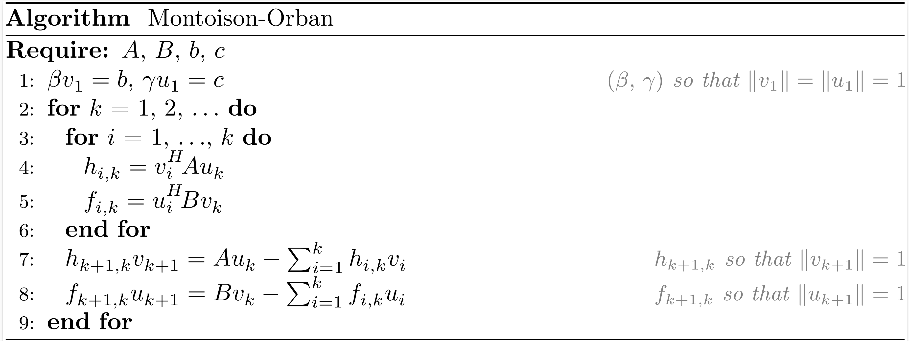

```@raw html
<style>
.content table td {
    border-right-width: 1px;
}
.content table th {
    border-right-width: 1px;
}
.content table td:last-child {
    border-right-width: 0px;
}
.content table th:last-child {
    border-right-width: 0px;
}
html.theme--documenter-dark .content table td {
    border-right-width: 1px;
}
html.theme--documenter-dark .content table th {
    border-right-width: 1px;
}
html.theme--documenter-dark .content table td:last-child {
    border-right-width: 0px;
}
html.theme--documenter-dark .content table th:last-child {
    border-right-width: 0px;
}
</style>
```

# [Krylov processes](@id krylov-processes)

Krylov processes are the foundation of Krylov methods, they generate bases of Krylov subspaces.
Depending on the Krylov subspaces generated, Krylov processes are more or less specialized for a subset of linear problems.
The following table summarizes the most relevant processes for each linear problem.

| Linear problems                                                |  Processes                        |
|:--------------------------------------------------------------:|:---------------------------------:|
| Hermitian linear systems                                       | Hermitian Lanczos                 |
| Square Non-Hermitian linear systems                            | Non-Hermitian Lanczos -- Arnoldi  |
| Least-squares problems                                         | Golub-Kahan -- Saunders-Simon-Yip |
| Least-norm problems                                            | Golub-Kahan -- Saunders-Simon-Yip |
| Saddle-point and Hermitian quasi-definite systems              | Golub-Kahan -- Saunders-Simon-Yip |
| Generalized saddle-point and non-Hermitian partitioned systems | Montoison-Orban                   |

### Notation

For a matrix $A$, $A^H$ denotes the conjugate transpose of $A$.
It coincides with $A^T$, the transpose of $A$, for real matrices.
Define $V_k := \begin{bmatrix} v_1 & \ldots & v_k \end{bmatrix} \enspace$ and $\enspace U_k := \begin{bmatrix} u_1 & \ldots & u_k \end{bmatrix}$.

For a matrix $C \in \mathbb{C}^{n \times n}$ and a vector $t \in \mathbb{C}^{n}$, the $k$-th Krylov subspace generated by $C$ and $t$ is
```math
\mathcal{K}_k(C, t) :=
\left\{\sum_{i=0}^{k-1} \omega_i C^i t \, \middle \vert \, \omega_i \in \mathbb{C},~0 \le i \le k-1 \right\}.
```

For matrices $C \in \mathbb{C}^{n \times n} \enspace$ and $\enspace T \in \mathbb{C}^{n \times p}$, the $k$-th block Krylov subspace generated by $C$ and $T$ is
```math
\mathcal{K}_k^{\square}(C, T) :=
\left\{\sum_{i=0}^{k-1} C^i T \, \Omega_i \, \middle \vert \, \Omega_i \in \mathbb{C}^{p \times p},~0 \le i \le k-1 \right\}.
```

## [Hermitian Lanczos](@id hermitian-lanczos)


After $k$ iterations of the Hermitian Lanczos process, the situation may be summarized as
```math
\begin{align*}
  A V_k &= V_k T_k + \beta_{k+1,k} v_{k+1} e_k^T = V_{k+1} T_{k+1,k}, \\
  V_k^H V_k &= I_k,
\end{align*}
```
where $V_k$ is an orthonormal basis of the Krylov subspace $\mathcal{K}_k(A,b)$,
```math
T_k =
\begin{bmatrix}
  \alpha_1 & \bar{\beta}_2 &         &               \\
  \beta_2  & \alpha_2      & \ddots  &               \\
           & \ddots        & \ddots  & \bar{\beta}_k \\
           &               & \beta_k & \alpha_k
\end{bmatrix}
, \qquad
T_{k+1,k} =
\begin{bmatrix}
  T_{k} \\
  \beta_{k+1} e_{k}^T
\end{bmatrix}.
```
Note that depending on how we normalize the vectors that compose $V_k$, $T_{k+1,k}$ can be a real tridiagonal matrix even if $A$ is a complex matrix.

The function [`hermitian_lanczos`](@ref hermitian_lanczos(::Any, ::AbstractVector{FC}, ::Int) where FC <: (Union{Complex{T}, T} where T <: AbstractFloat)) returns $V_{k+1}$, $\beta_1$ and $T_{k+1,k}$.

Related methods: [`SYMMLQ`](@ref symmlq), [`CG`](@ref cg), [`CR`](@ref cr), [`CAR`](@ref car), [`MINRES`](@ref minres), [`MINRES-QLP`](@ref minres_qlp), [`MINARES`](@ref minares), [`CGLS`](@ref cgls), [`CGLS-LANCZOS-SHIFT`](@ref cgls_lanczos_shift), [`CRLS`](@ref crls), [`CGNE`](@ref cgne), [`CRMR`](@ref crmr), [`CG-LANCZOS`](@ref cg_lanczos) and [`CG-LANCZOS-SHIFT`](@ref cg_lanczos_shift).

```@docs
hermitian_lanczos(::Any, ::AbstractVector{FC}, ::Int) where FC <: (Union{Complex{T}, T} where T <: AbstractFloat)
```

## [Non-Hermitian Lanczos](@id nonhermitian-lanczos)


After $k$ iterations of the non-Hermitian Lanczos process (also named the Lanczos biorthogonalization process), the situation may be summarized as
```math
\begin{align*}
  A V_k &= V_k T_k + \beta_{k+1} v_{k+1} e_k^T = V_{k+1} T_{k+1,k}, \\
  A^H U_k &= U_k T_k^H + \bar{\gamma}_{k+1} u_{k+1} e_k^T = U_{k+1} T_{k,k+1}^H, \\
  V_k^H U_k &= U_k^H V_k = I_k,
\end{align*}
```
where $V_k$ and $U_k$ are bases of the Krylov subspaces $\mathcal{K}_k (A,b)$ and $\mathcal{K}_k (A^H,c)$, respectively,
```math
T_k = 
\begin{bmatrix}
  \alpha_1 & \gamma_2 &          &          \\
  \beta_2  & \alpha_2 & \ddots   &          \\
           & \ddots   & \ddots   & \gamma_k \\
           &          & \beta_k  & \alpha_k
\end{bmatrix}
, \qquad
T_{k+1,k} =
\begin{bmatrix}
  T_{k} \\
  \beta_{k+1} e_{k}^T
\end{bmatrix}
, \qquad
T_{k,k+1} =
\begin{bmatrix}
  T_{k} & \gamma_{k+1} e_k
\end{bmatrix}.
```

The function [`nonhermitian_lanczos`](@ref nonhermitian_lanczos(::Any, ::AbstractVector{FC}, ::AbstractVector{FC}, ::Int) where FC <: (Union{Complex{T}, T} where T <: AbstractFloat)) returns $V_{k+1}$, $\beta_1$, $T_{k+1,k}$, $U_{k+1}$, $\bar{\gamma}_1$ and $T_{k,k+1}^H$.

Related methods: [`BiLQ`](@ref bilq), [`QMR`](@ref qmr), [`BiLQR`](@ref bilqr), [`CGS`](@ref cgs) and [`BICGSTAB`](@ref bicgstab).

!!! note
    The scaling factors used in our implementation are $\beta_k = |u_k^H v_k|^{\tfrac{1}{2}}$ and $\gamma_k = (u_k^H v_k) / \beta_k$.
    With these scaling factors, the non-Hermitian Lanczos process coincides with the Hermitian Lanczos process when $A = A^H$ and $b = c$.

```@docs
nonhermitian_lanczos(::Any, ::AbstractVector{FC}, ::AbstractVector{FC}, ::Int) where FC <: (Union{Complex{T}, T} where T <: AbstractFloat)
```

The non-Hermitian Lanczos process can be also implemented without $A^H$ (transpose-free variant).
To derive it, we can observe that $\beta_{k+1} v_{k+1} = P_k(A) b~~$ and $\bar{\gamma}_{k+1} u_{k+1} = Q_k(A^H) c~~$ where $P_k$ and $Q_k$ are polynomials of degree $k$.
The polynomials are defined from the recursions:
```math
\begin{align*}
  P_0(A)   &= I_n, \\
  P_1(A)   &= \left(\dfrac{A - \alpha_1 I_n}{\beta_1}\right) P_0(A), \\
  P_k(A)   &= \left(\dfrac{A - \alpha_k I_n}{\beta_k}\right) P_{k-1}(A) - \dfrac{\gamma_k}{\beta_{k-1}} P_{k-2}(A), \quad k \ge 2, \\
           & \\
  Q_0(A^H) &= I_n, \\
  Q_1(A^H) &= \left(\dfrac{A^H - \bar{\alpha}_1 I_n}{\bar{\gamma}_1}\right) Q_0(A^H), \\
  Q_k(A^H) &= \left(\dfrac{A^H - \bar{\alpha}_k I_n}{\bar{\gamma}_k}\right) Q_{k-1}(A^H) - \dfrac{\bar{\beta}_k}{\bar{\gamma}_{k-1}} Q_{k-2}(A^H), \quad k \ge 2.
\end{align*}
```

Because $\alpha_k = u_k^H A v_k$ and $(\bar{\gamma}_{k+1} u_{k+1})^H (\beta_{k+1} v_{k+1}) = \gamma_{k+1} \beta_{k+1}$, we can determine the coefficients of $T_{k+1,k}$ and $T_{k,k+1}^H$ as follows:
```math
\begin{align*}
  \alpha_k &= \dfrac{1}{\gamma_k \beta_k} \langle~Q_{k-1}(A^H) c \, , \, A P_{k-1}(A) b~\rangle \\
           &= \dfrac{1}{\gamma_k \beta_k} \langle~c \, , \, \bar{Q}_{k-1}(A) A P_{k-1}(A) b~\rangle, \\
           & \\
  \beta_{k+1} \gamma_{k+1} &= \langle~Q_k(A^H) c \, , \, P_k(A) b~\rangle \\
                           &= \langle~c \, , \, \bar{Q}_k(A) P_k(A) b~\rangle.
\end{align*}
```

## [Arnoldi](@id arnoldi)


After $k$ iterations of the Arnoldi process, the situation may be summarized as
```math
\begin{align*}
  A V_k &= V_k H_k + h_{k+1,k} v_{k+1} e_k^T = V_{k+1} H_{k+1,k}, \\
  V_k^H V_k &= I_k,
\end{align*}
```
where $V_k$ is an orthonormal basis of the Krylov subspace $\mathcal{K}_k (A,b)$,
```math
H_k =
\begin{bmatrix}
  h_{1,1}~ & h_{1,2}~ & \ldots    & h_{1,k}   \\
  h_{2,1}~ & \ddots~  & \ddots    & \vdots    \\
           & \ddots~  & \ddots    & h_{k-1,k} \\
           &          & h_{k,k-1} & h_{k,k}
\end{bmatrix}
, \qquad
H_{k+1,k} =
\begin{bmatrix}
  H_{k} \\
  h_{k+1,k} e_{k}^T
\end{bmatrix}.
```

The function [`arnoldi`](@ref arnoldi(::Any, ::AbstractVector{FC}, ::Int) where FC <: (Union{Complex{T}, T} where T <: AbstractFloat)) returns $V_{k+1}$, $\beta$ and $H_{k+1,k}$.

Related methods: [`DIOM`](@ref diom), [`FOM`](@ref fom), [`DQGMRES`](@ref dqgmres), [`GMRES`](@ref gmres) and [`FGMRES`](@ref fgmres).

!!! note
    The Arnoldi process coincides with the Hermitian Lanczos process when $A$ is Hermitian.

```@docs
arnoldi(::Any, ::AbstractVector{FC}, ::Int) where FC <: (Union{Complex{T}, T} where T <: AbstractFloat)
```

## [Golub-Kahan](@id golub-kahan)


After $k$ iterations of the Golub-Kahan bidiagonalization process, the situation may be summarized as
```math
\begin{align*}
  A V_k &= U_{k+1} B_k, \\
  A^H U_{k+1} &= V_k B_k^H + \bar{\alpha}_{k+1} v_{k+1} e_{k+1}^T = V_{k+1} L_{k+1}^H, \\
  V_k^H V_k &= U_k^H U_k = I_k,
\end{align*}
```
where $V_k$ and $U_k$ are bases of the Krylov subspaces $\mathcal{K}_k (A^HA,A^Hb)$ and $\mathcal{K}_k (AA^H,b)$, respectively,
```math
L_k =
\begin{bmatrix}
  \alpha_1 &          &          &          \\
  \beta_2  & \alpha_2 &          &          \\
           & \ddots   & \ddots   &          \\
           &          & \beta_k  & \alpha_k
\end{bmatrix}
, \qquad
B_k =
\begin{bmatrix}
  \alpha_1 &          &          &             \\
  \beta_2  & \alpha_2 &          &             \\
           & \ddots   & \ddots   &             \\
           &          & \beta_k  & \alpha_k    \\
           &          &          & \beta_{k+1} \\
\end{bmatrix}
=
\begin{bmatrix}
  L_{k} \\
  \beta_{k+1} e_{k}^T
\end{bmatrix}.
```
Note that depending on how we normalize the vectors that compose $V_k$ and $U_k$, $L_k$ can be a real bidiagonal matrix even if $A$ is a complex matrix.

The function [`golub_kahan`](@ref golub_kahan(::Any, ::AbstractVector{FC}, ::Int) where FC <: (Union{Complex{T}, T} where T <: AbstractFloat)) returns $V_{k+1}$, $U_{k+1}$, $\beta_1$ and $L_{k+1}$.

Related methods: [`LNLQ`](@ref lnlq), [`CRAIG`](@ref craig), [`CRAIGMR`](@ref craigmr), [`LSLQ`](@ref lslq), [`LSQR`](@ref lsqr) and [`LSMR`](@ref lsmr).

!!! note
    The Golub-Kahan process coincides with the Hermitian Lanczos process applied to the normal equations $A^HA x = A^Hb$ and $AA^H x = b$.
    It is also related to the Hermitian Lanczos process applied to $\begin{bmatrix} 0 & A \\ A^H & 0 \end{bmatrix}$ with initial vector $\begin{bmatrix} b \\ 0 \end{bmatrix}$.

```@docs
golub_kahan(::Any, ::AbstractVector{FC}, ::Int) where FC <: (Union{Complex{T}, T} where T <: AbstractFloat)
```

## [Saunders-Simon-Yip](@id saunders-simon-yip)


After $k$ iterations of the Saunders-Simon-Yip process (also named the orthogonal tridiagonalization process), the situation may be summarized as
```math
\begin{align*}
  A U_k &= V_k T_k + \beta_{k+1} v_{k+1} e_k^T = V_{k+1} T_{k+1,k}, \\
  A^H V_k &= U_k T_k^H + \bar{\gamma}_{k+1} u_{k+1} e_k^T = U_{k+1} T_{k,k+1}^H, \\
  V_k^H V_k &= U_k^H U_k = I_k,
\end{align*}
```
where $\begin{bmatrix} V_k & 0 \\ 0 & U_k \end{bmatrix}$ is an orthonormal basis of the block Krylov subspace $\mathcal{K}^{\square}_k \left(\begin{bmatrix} 0 & A \\ A^H & 0 \end{bmatrix}, \begin{bmatrix} b & 0 \\ 0 & c \end{bmatrix}\right)$,
```math
T_k = 
\begin{bmatrix}
  \alpha_1 & \gamma_2 &          &          \\
  \beta_2  & \alpha_2 & \ddots   &          \\
           & \ddots   & \ddots   & \gamma_k \\
           &          & \beta_k  & \alpha_k
\end{bmatrix}
, \qquad
T_{k+1,k} =
\begin{bmatrix}
  T_{k} \\
  \beta_{k+1} e_{k}^T
\end{bmatrix}
, \qquad
T_{k,k+1} =
\begin{bmatrix}
  T_{k} & \gamma_{k+1} e_{k}
\end{bmatrix}.
```

The function [`saunders_simon_yip`](@ref saunders_simon_yip(::Any, ::AbstractVector{FC}, ::AbstractVector{FC}, ::Int) where FC <: (Union{Complex{T}, T} where T <: AbstractFloat)) returns $V_{k+1}$, $\beta_1$, $T_{k+1,k}$, $U_{k+1}$, $\bar{\gamma}_1$ and $T_{k,k+1}^H$.

Related methods: [`USYMLQ`](@ref usymlq), [`USYMQR`](@ref usymqr), [`USYMLQR`](@ref usymlqr), [`TriLQR`](@ref trilqr), [`TriCG`](@ref tricg) and [`TriMR`](@ref trimr).

!!! note
    The Saunders-Simon-Yip is equivalent to the block-Lanczos process applied to $\begin{bmatrix} 0 & A \\ A^H & 0 \end{bmatrix}$ with initial matrix $\begin{bmatrix} b & 0 \\ 0 & c \end{bmatrix}$.

```@docs
saunders_simon_yip(::Any, ::AbstractVector{FC}, ::AbstractVector{FC}, ::Int) where FC <: (Union{Complex{T}, T} where T <: AbstractFloat)
```

## [Montoison-Orban](@id montoison-orban)



After $k$ iterations of the Montoison-Orban process (also named the orthogonal Hessenberg reduction process), the situation may be summarized as
```math
\begin{align*}
  A U_k &= V_k H_k + h_{k+1,k} v_{k+1} e_k^T = V_{k+1} H_{k+1,k}, \\
  B V_k &= U_k F_k + f_{k+1,k} u_{k+1} e_k^T = U_{k+1} F_{k+1,k}, \\
  V_k^H V_k &= U_k^H U_k = I_k,
\end{align*}
```
where $\begin{bmatrix} V_k & 0 \\ 0 & U_k \end{bmatrix}$ is an orthonormal basis of the block Krylov subspace $\mathcal{K}^{\square}_k \left(\begin{bmatrix} 0 & A \\ B & 0 \end{bmatrix}, \begin{bmatrix} b & 0 \\ 0 & c \end{bmatrix}\right)$,
```math
H_k =
\begin{bmatrix}
  h_{1,1}~ & h_{1,2}~ & \ldots    & h_{1,k}   \\
  h_{2,1}~ & \ddots~  & \ddots    & \vdots    \\
           & \ddots~  & \ddots    & h_{k-1,k} \\
           &          & h_{k,k-1} & h_{k,k}
\end{bmatrix}
, \qquad
F_k =
\begin{bmatrix}
  f_{1,1}~ & f_{1,2}~ & \ldots    & f_{1,k}   \\
  f_{2,1}~ & \ddots~  & \ddots    & \vdots    \\
           & \ddots~  & \ddots    & f_{k-1,k} \\
           &          & f_{k,k-1} & f_{k,k}
\end{bmatrix},
```
```math
H_{k+1,k} =
\begin{bmatrix}
  H_{k} \\
  h_{k+1,k} e_{k}^T
\end{bmatrix}
, \qquad
F_{k+1,k} =
\begin{bmatrix}
  F_{k} \\
  f_{k+1,k} e_{k}^T
\end{bmatrix}.
```

The function [`montoison_orban`](@ref montoison_orban(::Any, ::Any, ::AbstractVector{FC}, ::AbstractVector{FC}, ::Int) where FC <: (Union{Complex{T}, T} where T <: AbstractFloat)) returns $V_{k+1}$, $\beta$, $H_{k+1,k}$, $U_{k+1}$, $\gamma$ and $F_{k+1,k}$.

Related methods: [`GPMR`](@ref gpmr).

!!! note
    The Montoison-Orban is equivalent to the block-Arnoldi process applied to $\begin{bmatrix} 0 & A \\ B & 0 \end{bmatrix}$ with initial matrix $\begin{bmatrix} b & 0 \\ 0 & c \end{bmatrix}$.
    It also coincides with the Saunders-Simon-Yip process when $B = A^H$.

```@docs
montoison_orban(::Any, ::Any, ::AbstractVector{FC}, ::AbstractVector{FC}, ::Int) where FC <: (Union{Complex{T}, T} where T <: AbstractFloat)
```
