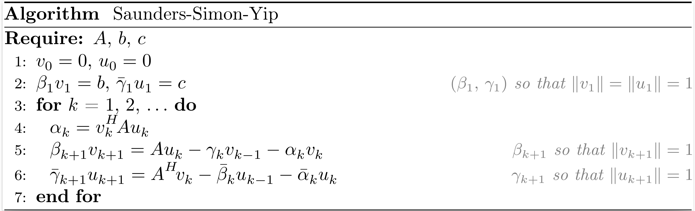

### Notations

Define $V_k := \begin{bmatrix} v_1 & \ldots & v_k \end{bmatrix} \enspace$ and $\enspace U_k := \begin{bmatrix} u_1 & \ldots & u_k \end{bmatrix}$.

For a matrix $C \in \mathbb{C}^{n \times n}$ and a vector $t \in \mathbb{C}^{n}$,
```math
\mathcal{K}_k(C, t) :=
\left\{\sum_{i=0}^{k-1} \omega_i C^i t \, \middle \vert \, \omega_i \in \mathbb{C},~0 \le i \le k-1 \right\}.
```

For matrices $C \in \mathbb{C}^{n \times n} \enspace$ and $\enspace T \in \mathbb{C}^{n \times p}$,
```math
\mathcal{K}_k^{\square}(C, T) :=
\left\{\sum_{i=0}^{k-1} C^i T \, \Omega_i \, \middle \vert \, \Omega_i \in \mathbb{C}^{p \times p},~0 \le i \le k-1 \right\}.
```

## Symmetric Lanczos


After $k$ iterations of the symmetric Lanczos process, the situation may be summarized as
```math
\begin{align*}
  A V_k &= V_k T_k + \beta_{k+1,k} v_{k+1} e_k^T = V_{k+1}  T_{k+1,k}, \\
  V_k^T V_k &= I_k,
\end{align*}
```
where $V_k$ is an orthonormal basis of the Krylov subspace $\mathcal{K}_k (A,b)$,
```math
T_k =
\begin{bmatrix}
  \alpha_1 & \beta_2  &          &         \\
  \beta_2  & \alpha_2 & \ddots   &         \\
           & \ddots   & \ddots   & \beta_k \\
           &          & \beta_k  & \alpha_k
\end{bmatrix}
, \qquad
T_{k+1,k} =
\begin{bmatrix}
  T_{k} \\
  \beta_{k+1} e_{k}^T
\end{bmatrix}.
```

Methods related: [`SYMMLQ`](@ref symmlq), [`CG`](@ref cg), [`CR`](@ref cr), [`MINRES`](@ref minres), [`MINRES-QLP`](@ref minres_qlp), [`CGLS`](@ref cgls), [`CRLS`](@ref crls), [`CGNE`](@ref cgne), [`CRMR`](@ref crmr), [`CG-LANCZOS`](@ref cg_lanczos) and [`CG-LANCZOS-SHIFT`](@ref cg_lanczos_shift).

```@docs
symmetric_lanczos
```

## Unsymmetric Lanczos


After $k$ iterations of the unsymmetric Lanczos process (also named the Lanczos biorthogonalization process), the situation may be summarized as
```math
\begin{align*}
  A V_k &= V_k T_k +        \beta_{k+1} v_{k+1} e_k^T = V_{k+1} T_{k+1,k}, \\
  B U_k &= U_k S_k + \bar{\gamma}_{k+1} u_{k+1} e_k^T = U_{k+1} S_{k+1,k}, \\
  V_k^T U_k &= U_k^T V_k = I_k,
\end{align*}
```
where $V_k$ and $U_k$ are bases of the Krylov subspaces $\mathcal{K}_k (A,b)$ and $\mathcal{K}_k (A^T,c)$, respectively,
```math
T_k = 
\begin{bmatrix}
  \alpha_1 & \gamma_2 &          &          \\
  \beta_2  & \alpha_2 & \ddots   &          \\
           & \ddots   & \ddots   & \gamma_k \\
           &          & \beta_k  & \alpha_k
\end{bmatrix}
, \qquad
S_k =
\begin{bmatrix}
  \bar{\alpha}_1 & \bar{\beta}_2  &                 &                \\
  \bar{\gamma}_2 & \bar{\alpha}_2 & \ddots          &                \\
                 & \ddots         & \ddots          & \bar{\beta}_k  \\
                 &                & \bar{\gamma}_k  & \bar{\alpha}_k
\end{bmatrix},
```
```math
T_{k+1,k} =
\begin{bmatrix}
  T_{k} \\
  \beta_{k+1} e_{k}^T
\end{bmatrix}
, \qquad
S_{k+1,k} =
\begin{bmatrix}
  S_{k} \\
  \bar{\gamma}_{k+1} e_{k}^T
\end{bmatrix}.
```

!!! note
    We also have the relations $T_k = S_k^T$, $\enspace T_{k,k+1} = \begin{bmatrix} T_{k} & \gamma_{k+1} e_k \end{bmatrix} = S_{k+1,k}^T \enspace$ and $\enspace S_{k,k+1} = \begin{bmatrix} S_{k} & \bar{\beta}_{k+1} e_k \end{bmatrix} = T_{k+1,k}^T$.

Methods related: [`BiLQ`](@ref bilq), [`QMR`](@ref qmr), [`BiLQR`](@ref bilqr), [`CGS`](@ref cgs) and [`BICGSTAB`](@ref bicgstab).

```@docs
unsymmetric_lanczos
```

## Arnoldi


After $k$ iterations of the Arnoldi process, the situation may be summarized as
```math
\begin{align*}
  A V_k &= V_k H_k + h_{k+1,k} v_{k+1} e_k^T = V_{k+1} H_{k+1,k}, \\
  V_k^T V_k &= I_k,
\end{align*}
```
where $V_k$ is an orthonormal basis of the Krylov subspace $\mathcal{K}_k (A,b)$,
```math
H_k =
\begin{bmatrix}
  h_{1,1}~ & h_{1,2}~ & \ldots    & h_{1,k}   \\
  h_{2,1}~ & \ddots~  & \ddots    & \vdots    \\
           & \ddots~  & \ddots    & h_{k-1,k} \\
           &          & h_{k,k-1} & h_{k,k}
\end{bmatrix}
, \qquad
H_{k+1,k} =
\begin{bmatrix}
  H_{k} \\
  h_{k+1,k} e_{k}^T
\end{bmatrix}.
```

Methods related: [`DIOM`](@ref diom), [`FOM`](@ref fom), [`DQGMRES`](@ref dqgmres) and [`GMRES`](@ref gmres).

```@docs
arnoldi
```

## Golub-Kahan


```@docs
golub_kahan
```

After $k$ iterations of the Golub-Kahan bidiagonalization process, the situation may be summarized as
```math
\begin{align*}
  A V_k &= U_{k+1} B_k,   \\
  A^T U_{k+1} &= V_k B_k^T + \alpha_{k+1} v_{k+1} e_{k+1}^T = V_{k+1} L_{k+1}^T, \\
  V_k^T V_k &= U_k^T U_k = I_k,
\end{align*}
```
where $V_k$ and $U_k$ are bases of the Krylov subspaces $\mathcal{K}_k (A^TA,A^Tb)$ and $\mathcal{K}_k (AA^T,b)$, respectively,
```math
L_k =
\begin{bmatrix}
  \alpha_1 &          &          &          \\
  \beta_2  & \alpha_2 &          &          \\
           & \ddots   & \ddots   &          \\
           &          & \beta_k  & \alpha_k
\end{bmatrix}
, \qquad
B_k =
\begin{bmatrix}
  \alpha_1 &          &          &             \\
  \beta_2  & \alpha_2 &          &             \\
           & \ddots   & \ddots   &             \\
           &          & \beta_k  & \alpha_k    \\
           &          &          & \beta_{k+1} \\
\end{bmatrix}
=
\begin{bmatrix}
  L_{k} \\
  \beta_{k+1} e_{k}^T
\end{bmatrix}.
```

Methods related: [`LNLQ`](@ref lnlq), [`CRAIG`](@ref craig), [`CRAIGMR`](@ref craigmr), [`LSLQ`](@ref lslq), [`LSQR`](@ref lsqr) and [`LSMR`](@ref lsmr).

## Saunders-Simon-Yip



After $k$ iterations of the Saunders-Simon-Yip process (also named the orthogonal tridiagonalization process), the situation may be summarized as
```math
\begin{align*}
  A U_k &= V_k T_k + \beta_{k+1}  v_{k+1} e_k^T = V_{k+1} T_{k+1,k}, \\
  B V_k &= U_k S_k + \gamma_{k+1} u_{k+1} e_k^T = U_{k+1} S_{k+1,k}, \\
  V_k^T V_k &= U_k^T U_k = I_k,
\end{align*}
```
where $\begin{bmatrix} V_k & 0 \\ 0 & U_k \end{bmatrix}$ is an orthonormal basis of the block Krylov subspace $\mathcal{K}^{\square}_k \left(\begin{bmatrix} 0 & A \\ A^T & 0 \end{bmatrix}, \begin{bmatrix} b & 0 \\ 0 & c \end{bmatrix}\right)$,
```math
T_k = 
\begin{bmatrix}
  \alpha_1 & \gamma_2 &          &          \\
  \beta_2  & \alpha_2 & \ddots   &          \\
           & \ddots   & \ddots   & \gamma_k \\
           &          & \beta_k  & \alpha_k
\end{bmatrix}
, \qquad
S_k =
\begin{bmatrix}
  \bar{\alpha}_1 & \beta_2        &          &               \\
  \gamma_2       & \bar{\alpha}_2 & \ddots   &               \\
                 & \ddots         & \ddots   & \beta_k       \\
                 &                & \gamma_k  & \bar{\alpha}_k
\end{bmatrix},
```
```math
T_{k+1,k} =
\begin{bmatrix}
  T_{k} \\
  \beta_{k+1} e_{k}^T
\end{bmatrix}
, \qquad
S_{k+1,k} =
\begin{bmatrix}
  S_{k} \\
  \gamma_{k+1} e_{k}^T
\end{bmatrix}.
```

!!! note
    We also have the relations $T_k = S_k^T$, $\enspace T_{k,k+1} = \begin{bmatrix} T_{k} & \gamma_{k+1} e_k \end{bmatrix} = S_{k+1,k}^T \enspace$ and $\enspace S_{k,k+1} = \begin{bmatrix} S_{k} & \beta_{k+1} e_k \end{bmatrix} = T_{k+1,k}^T$.

Methods related: [`USYMLQ`](@ref usymlq), [`USYMQR`](@ref usymqr), [`TriLQR`](@ref trilqr), [`TriCG`](@ref tricg) and [`TriMR`](@ref trimr).

```@docs
saunders_simon_yip
```

## Montoison-Orban


After $k$ iterations of the Montoison-Orban process (also named the orthogonal Hessenberg reduction process), the situation may be summarized as
```math
\begin{align*}
  A U_k &= V_k H_k + h_{k+1,k} v_{k+1} e_k^T = V_{k+1} H_{k+1,k}, \\
  B V_k &= U_k F_k + f_{k+1,k} u_{k+1} e_k^T = U_{k+1} F_{k+1,k}, \\
  V_k^T V_k &= U_k^T U_k = I_k,
\end{align*}
```
where $\begin{bmatrix} V_k & 0 \\ 0 & U_k \end{bmatrix}$ is an orthonormal basis of the block Krylov subspace $\mathcal{K}^{\square}_k \left(\begin{bmatrix} 0 & A \\ B & 0 \end{bmatrix}, \begin{bmatrix} b & 0 \\ 0 & c \end{bmatrix}\right)$,
```math
H_k =
\begin{bmatrix}
  h_{1,1}~ & h_{1,2}~ & \ldots    & h_{1,k}   \\
  h_{2,1}~ & \ddots~  & \ddots    & \vdots    \\
           & \ddots~  & \ddots    & h_{k-1,k} \\
           &          & h_{k,k-1} & h_{k,k}
\end{bmatrix}
, \qquad
F_k =
\begin{bmatrix}
  f_{1,1}~ & f_{1,2}~ & \ldots    & f_{1,k}   \\
  f_{2,1}~ & \ddots~  & \ddots    & \vdots    \\
           & \ddots~  & \ddots    & f_{k-1,k} \\
           &          & f_{k,k-1} & f_{k,k}
\end{bmatrix},
```
```math
H_{k+1,k} =
\begin{bmatrix}
  H_{k} \\
  h_{k+1,k} e_{k}^T
\end{bmatrix}
, \qquad
F_{k+1,k} =
\begin{bmatrix}
  F_{k} \\
  f_{k+1,k} e_{k}^T
\end{bmatrix}.
```

Methods related: [`GPMR`](@ref gpmr).

```@docs
montoison_orban
```
