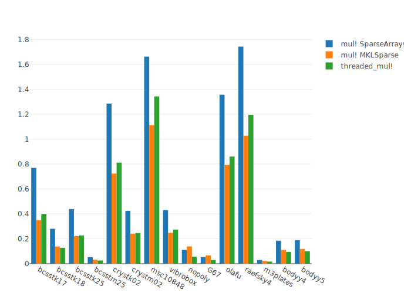

The most expensive procedures in Krylov methods are matrix-vector products (y ← Ax) and vector operations (dot products, vector norms, y ← αx + βy).
Therefore they directly affect the efficiency of the methods provided by `Krylov.jl`.  
In this section, we present various optimizations based on multithreading to speed up these procedures. 
Multithreading is a form of shared memory parallelism that makes use of multiple cores to perform tasks.

## Multi-threaded BLAS and LAPACK operations

```shell
OPENBLAS_NUM_THREADS=N julia  # Set the number of OpenBLAS threads to N
MKL_NUM_THREADS=N julia       # Set the number of MKL threads to N
```

If you don't know the maximum number of threads available on your computer, you can obtain it with

```julia
NMAX = Sys.CPU_THREADS
```

and define the number of OpenBLAS/MKL threads at runtime with

```julia
BLAS.set_num_threads(N)  # 1 ≤ N ≤ NMAX
BLAS.get_num_threads()
```

The recommended number of BLAS threads is the number of physical and not logical cores, which is in general `N = NMAX / 2` if your CPU supports simultaneous multithreading (SMT).

By default Julia ships with OpenBLAS but it's also possible to use Intel MKL BLAS and LAPACK with [MKL.jl](https://github.com/JuliaLinearAlgebra/MKL.jl).
If your operating system is MacOS 13.4 or later, it's recommended to use Accelerate BLAS and LAPACK with [AppleAccelerate.jl](https://github.com/JuliaLinearAlgebra/AppleAccelerate.jl).

```julia
using LinearAlgebra
BLAS.get_config()  # BLAS.vendor() for Julia 1.6
```

## Multi-threaded sparse matrix-vector products

For sparse matrices, the Julia implementation of `mul!` of [SparseArrays](https://docs.julialang.org/en/v1/stdlib/SparseArrays/) library is not parallelized.
A significant speed-up can be observed with the multhreaded `mul!` of [MKLSparse.jl](https://github.com/JuliaSparse/MKLSparse.jl) or [ThreadedSparseCSR.jl](https://github.com/BacAmorim/ThreadedSparseCSR.jl).

It's also possible to implement a generic multithreaded julia version.
For instance, the following function can be used for symmetric matrices

```julia
using Base.Threads

function threaded_mul!(y::Vector{T}, A::SparseMatrixCSC{T}, x::Vector{T}) where T <: Number
  A.m == A.n || error("A is not a square matrix!")
  @threads for i = 1 : A.n
    tmp = zero(T)
    @inbounds for j = A.colptr[i] : (A.colptr[i+1] - 1)
      tmp += A.nzval[j] * x[A.rowval[j]]
    end
    @inbounds y[i] = tmp
  end
  return y
end
```

and wrapped inside a linear operator to solve symmetric linear systems

```julia
using LinearOperators

n, m = size(A)
sym = herm = true
T = eltype(A)
opA = LinearOperator(T, n, m, sym, herm, (y, v) -> threaded_mul!(y, A, v))
```

To enable multi-threading with Julia, you can start julia with the environment variable `JULIA_NUM_THREADS` or the options `-t` and `--threads`

```shell
julia -t auto  # alternative: --threads auto
julia -t N     # alternative: --threads N

JULIA_NUM_THREADS=N julia
```

Thereafter, you can verify the number of threads usable by Julia

```julia
using Base.Threads
nthreads()
```

The following benchmarks illustrate the time required in seconds to compute 1000 sparse matrix-vector products with symmetric matrices of the SuiteSparse Matrix Collection.
The computer used for the benchmarks has 2 physical cores and Julia was launched with `JULIA_NUM_THREADS=2`.


